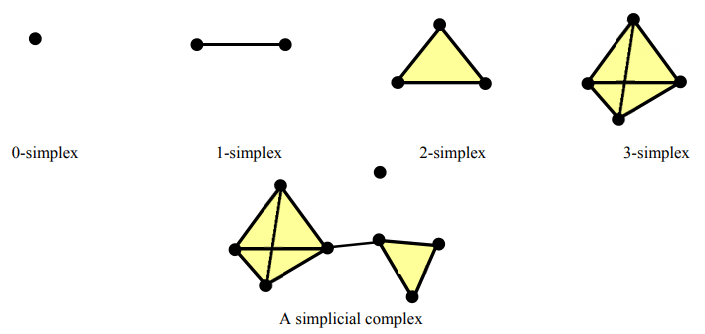

# Cython Wrapper for Topological Data Analysis
> **@author** Lorenzo Molfetta

This project provides a **Cython wrapper** for the **CompHom** library, a high-performance tool written in C++ for analyzing the topology of spaces via **simplicial homology**. The wrapper allows Python users to harness the capabilities of CompHom in their workflows, enabling efficient computation of **topological data analysis (TDA)**.



### **Key Concepts**

#### **Simplicial Complex**
A simplicial complex is a set of simplices (e.g., points, edges, triangles) that represent a topological space. The test script visualizes each triangulation as a 2D or 3D simplicial complex.

#### **Homology Groups**
Homology groups capture key topological features:
- **Dimension 0**: Connected components.
- **Dimension 1**: Loops or cycles.
- **Dimension 2**: Voids or cavities.


## About the Original CompHom Library

### **What is CompHom?**
[**CompHom**](https://github.com/Pseudomanifold/CompHom) computes **simplicial homology groups** of triangulated simplicial complexes. It provides insights into the shape and structure of data by analyzing the connectivity and higher-dimensional features of simplicial complexes.


### **How CompHom Works**
1. **Input**: 
   - A **triangulation**, which represents a topological space using simplices (e.g., points, edges, triangles, and higher-dimensional equivalents).
2. **Output**: 
   - Homology groups for each triangulation, including:
     - **Rank (Free Part)**: Indicates the number of independent features, such as connected components and loops.
     - **Torsion Part**: Represents cyclic structures with finite order, expressed as `Z_n`.


## Code Structure

```
project/
├─ CompHom/
|   └─ Original C++ scripts
|
├─ src/
|   ├─ comphom_wrapper.pyx - Cython wrapping functions
|   ├─ setup.py - Script for compiling the wrapper
|   ├─ test_comphom.py - Testing script
|   └─ compiled object files
|
├─ build/
|   └─ Build configuration files
|
└─ test_files/
    ├─ Input triangulation files
    └─ Outputs and visualizations
```

## Installation and Usage

### Preprocess Input Triangulation Data
Input triangulation files must be preprocessed to ensure compatibility with **CompHom**. Use the provided tool to convert triangulation data:
```bash
perl CompHom/lex_convert.pl --input <DIR_PATH>/<FILE_NAME>
```
This generates a `<DIR_PATH>/<FILE_NAME>.ct` file, which is the required input format for the computation scripts.

### Build the Cython Extension
Compile the Cython wrapper to enable Python access to **CompHom** functions:
```bash
cd src
python setup.py build_ext --inplace
```

### Run Tests
Two test scripts are provided to validate the functionality of the wrapper and demonstrate its features:

1. **Basic Testing**: 
   - Runs the core tests for homology computation.
   - Execute with:
     ```bash
     python src/test_comphom.py
     ```

2. **Testing with Visualizations**:
   - Computes homology groups and generates detailed visualizations.
   - Execute with:
     ```bash
     python src/test_comphom_w_visualization.py
     ```

Additional triangulation datasets can be downloaded [here](https://www3.math.tu-berlin.de/IfM/Nachrufe/Frank_Lutz/stellar/mixed.html).


## Visualizations and Outputs

The test script with visualizations generates the following:

#### Simplicial Complex
- **Description**: A graphical depiction of vertices, edges, and triangles of the triangulation.
- **Purpose**: Verifies the structure of the input simplicial complex.

#### Boundary Matrix Heatmap
- **Description**: Heatmaps representing the relationship between simplices across dimensions.
- **Purpose**: Provides insights into the structure of the boundary matrices used for homology computation.

#### Homology Groups
- **Description**: Summarizes computed topological features such as connected components, loops, and voids.
- **Purpose**: Highlights the topological properties of the triangulation.

All visualizations are saved in structured subdirectories under `test_files/plots`:
- **simplicial_complex/**: Plots of the triangulations.
- **boundary_matrices/**: Heatmaps of the boundary relationships.
- **homology_groups/**: Visual summaries of the homology groups.